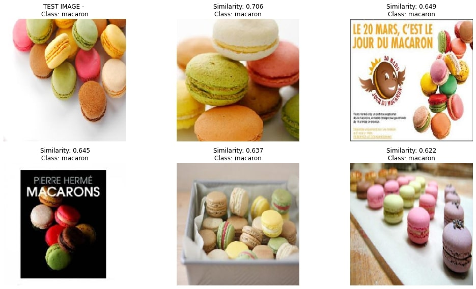
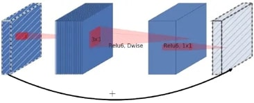
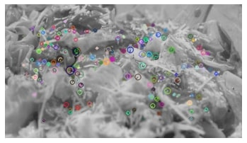
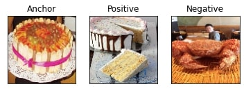

# Content Based Image Retrieval using FoodX-251 dataset

***Part of Visual Image Processing project | UniMiB***

The purpose of the project is to compare three different methods for retrieval of best 5 similar images given a query one.

Main differences of the methods:

1. CNN as feature extractor using cosine similarity

2. BoWA (Bag of Words using AKAZE descriptors)

Reference: Muhammad, Usman, et al. "Bag of words KAZE (BoWK) with two‐step classification for high‐resolution remote sensing images." IET Computer Vision 13.4 (2019): 395-403.

3. Siamese network trained using triplet loss as feature extractor

